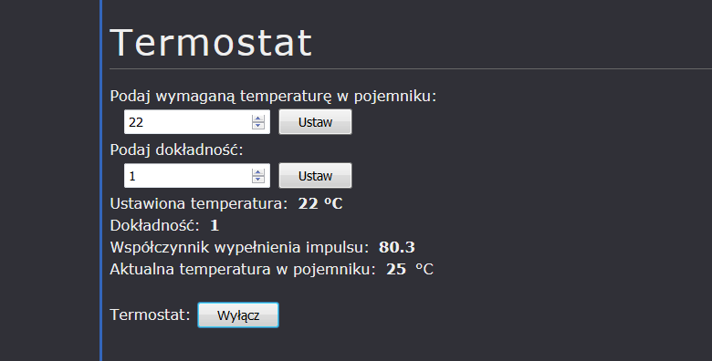

# Thermostat Beagle Bone Black

University project for "Embedded systems". Simple thermostat web application runnable on Beagle Bone Black microcomputer written in Python 3 using flask package, simple HTML, CSS and JavaScript.

## Prerequisites

* Flask

## Screenshots

